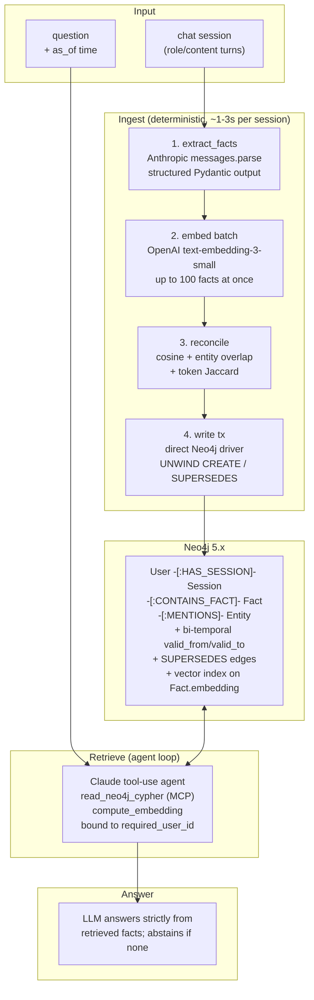

# neo4j-agent-memory

A general-purpose memory layer for AI agents and chat assistants. Stores conversations
as a bi-temporal knowledge graph in Neo4j; extracts atomic facts deterministically via
structured LLM output; retrieves via an agent loop that writes its own Cypher over MCP.

The design philosophy: keep the LLM where reasoning matters (extraction + retrieval),
keep Python where determinism matters (embeddings, writes, supersession).

## Architecture



## Why this design?

- **Memory must be honest.** Returning no fact is a valid answer. The retrieval agent is
  constrained to return only facts connected to the active `user_id` and never to
  fabricate.
- **Memory must be auditable.** Bi-temporal storage (`valid_from`, `valid_to`,
  `SUPERSEDES` edges) means you can answer "what did the user previously believe?"
  without losing history.
- **Memory must be cheap to maintain.** Ingest is one structured-output LLM call per
  session, not an agent loop. ~1-3s per session on Opus 4.7 effort=low.
- **Memory must be safe across tenants.** Every node carries `user_id`; every Cypher
  query the agent generates is validated to bind `params.user_id` before execution.

## Quick start

```bash
# 1. start neo4j with apoc + vector index support
docker run -d --name neo4j-memory \
  -p 7687:7687 -p 7474:7474 \
  -e NEO4J_AUTH=neo4j/testpassword \
  -e NEO4J_PLUGINS='["apoc"]' \
  neo4j:5.20-community

# 2. set env vars
export ANTHROPIC_API_KEY=sk-...
export OPENAI_API_KEY=sk-...
export NEO4J_URI=bolt://localhost:7687
export NEO4J_USER=neo4j
export NEO4J_PASSWORD=testpassword

# 3. install deps
uv venv && source .venv/bin/activate
uv pip install anthropic openai neo4j mcp pydantic
```

```python
import asyncio
from neo4j_memory import Neo4jAgentProvider, Session

async def main():
    provider = Neo4jAgentProvider()
    await provider.initialize()
    try:
        # ingest a chat session
        sessions = [
            Session(
                id="s1",
                timestamp="2026-05-17T10:00:00Z",
                messages=[
                    {"role": "user", "content": "I just moved to Berlin from Munich."},
                    {"role": "assistant", "content": "Got it, you're in Berlin now."},
                ],
            )
        ]
        await provider.ingest(sessions, user_id="alice")

        # later: search
        context = await provider.search(
            "Where do I live now?", user_id="alice",
            as_of="2026-05-18T10:00:00Z",
        )
        print(context)  # list[dict] of retrieved facts
    finally:
        await provider.close()

asyncio.run(main())
```

## Running the LongMemEval benchmark

This repo ships a harness for [LongMemEval](https://github.com/xiaowu0162/LongMemEval)
(Wu et al., ICLR 2025) so you can compare against published numbers for mem0,
Supermemory, Zep, and friends.

```bash
# get the benchmark data (~278 MB)
mkdir -p data
huggingface-cli download xiaowu0162/longmemeval longmemeval_s \
  --local-dir data --repo-type dataset
mv data/longmemeval_s data/longmemeval_full.json

# run the full 500-example benchmark
PYTHONPATH=. LIMIT=500 EXAMPLE_CONCURRENCY=2 python -m eval.harness

# or smoke-test on 1 example
PYTHONPATH=. python -m eval.smoke
```

Results stream to `results.jsonl` (one record per example, includes
`question / ground_truth / hypothesis / correct / elapsed_s`). Final accuracy
prints at the end.

Other harness utilities:
- `eval/resume.py` — resume an interrupted run by skipping already-ingested users
- `eval/search_only.py` — re-run retrieval against an existing graph without re-ingesting

## Layout

```
neo4j_memory/
  __init__.py
  schema.py     # idempotent DDL: constraints + vector + fulltext indexes
  extract.py    # Anthropic structured-output fact extraction
  writer.py    # OpenAI embeddings + supersession + Neo4j write tx
  prompts.py    # INGEST / RETRIEVE / ANSWER prompts
  agent.py      # Claude tool-use loop for the retrieval path (MCP-backed)
  provider.py   # public ingest/search/clear API

eval/
  harness.py     # LongMemEval driver with parallel examples + sessions
  smoke.py       # single-example end-to-end smoke test
  resume.py      # resume an interrupted ingest
  search_only.py # retrieval-only against existing graph
```

## Required environment

- Python 3.11+
- Docker (for Neo4j 5.11+)
- Anthropic API key (Opus 4.7 used by default for extraction)
- OpenAI API key (text-embedding-3-small for embeddings)

## License

MIT — see [LICENSE](LICENSE).
